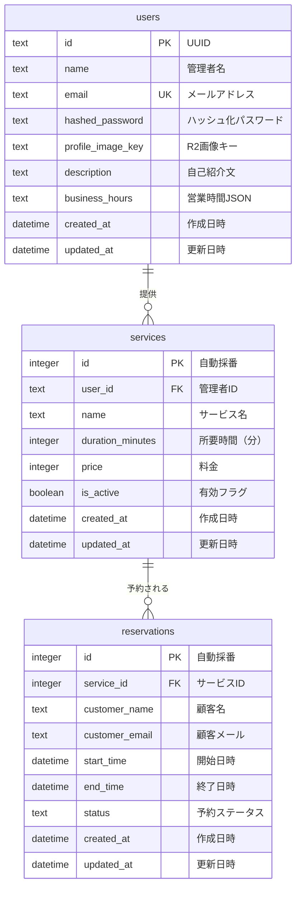

# Appointy データベース設計（ER図）

## ER図



## テーブル詳細

### usersテーブル（管理者情報）
| カラム名 | データ型 | 制約 | 説明 |
|---------|---------|------|------|
| id | TEXT | PRIMARY KEY | UUID形式の一意識別子 |
| name | TEXT | NOT NULL | 管理者の名前 |
| email | TEXT | UNIQUE, NOT NULL | ログイン用メールアドレス |
| hashed_password | TEXT | NOT NULL | bcryptでハッシュ化されたパスワード |
| profile_image_key | TEXT | NULL | R2に保存されたプロフィール画像のキー |
| description | TEXT | NULL | 自己紹介文 |
| business_hours | TEXT | NULL | 営業時間（JSON形式） |
| created_at | DATETIME | NOT NULL | レコード作成日時 |
| updated_at | DATETIME | NOT NULL | レコード更新日時 |

### servicesテーブル（提供サービス）
| カラム名 | データ型 | 制約 | 説明 |
|---------|---------|------|------|
| id | INTEGER | PRIMARY KEY AUTOINCREMENT | サービスID |
| user_id | TEXT | FOREIGN KEY, NOT NULL | 管理者ID（users.idへの外部キー） |
| name | TEXT | NOT NULL | サービス名 |
| duration_minutes | INTEGER | NOT NULL | 所要時間（分） |
| price | INTEGER | NOT NULL | 料金（円） |
| is_active | BOOLEAN | NOT NULL DEFAULT true | サービスの有効/無効 |
| created_at | DATETIME | NOT NULL | レコード作成日時 |
| updated_at | DATETIME | NOT NULL | レコード更新日時 |

### reservationsテーブル（予約情報）
| カラム名 | データ型 | 制約 | 説明 |
|---------|---------|------|------|
| id | INTEGER | PRIMARY KEY AUTOINCREMENT | 予約ID |
| service_id | INTEGER | FOREIGN KEY, NOT NULL | サービスID（services.idへの外部キー） |
| customer_name | TEXT | NOT NULL | 顧客の名前 |
| customer_email | TEXT | NOT NULL | 顧客のメールアドレス |
| start_time | DATETIME | NOT NULL | 予約開始日時（ISO 8601形式） |
| end_time | DATETIME | NOT NULL | 予約終了日時（ISO 8601形式） |
| status | TEXT | NOT NULL DEFAULT 'confirmed' | 予約ステータス（confirmed/cancelled） |
| created_at | DATETIME | NOT NULL | レコード作成日時 |
| updated_at | DATETIME | NOT NULL | レコード更新日時 |

## インデックス設計

```sql
-- ユーザー検索用
CREATE INDEX idx_users_email ON users(email);

-- サービス検索用
CREATE INDEX idx_services_user_id ON services(user_id);
CREATE INDEX idx_services_is_active ON services(is_active);

-- 予約検索用
CREATE INDEX idx_reservations_service_id ON reservations(service_id);
CREATE INDEX idx_reservations_start_time ON reservations(start_time);
CREATE INDEX idx_reservations_status ON reservations(status);
CREATE INDEX idx_reservations_customer_email ON reservations(customer_email);
```

## 営業時間（business_hours）のJSON形式

```json
{
  "monday": {
    "isOpen": true,
    "openTime": "09:00",
    "closeTime": "18:00"
  },
  "tuesday": {
    "isOpen": true,
    "openTime": "09:00",
    "closeTime": "18:00"
  },
  "wednesday": {
    "isOpen": true,
    "openTime": "09:00",
    "closeTime": "18:00"
  },
  "thursday": {
    "isOpen": true,
    "openTime": "09:00",
    "closeTime": "18:00"
  },
  "friday": {
    "isOpen": true,
    "openTime": "09:00",
    "closeTime": "18:00"
  },
  "saturday": {
    "isOpen": false,
    "openTime": null,
    "closeTime": null
  },
  "sunday": {
    "isOpen": false,
    "openTime": null,
    "closeTime": null
  }
}
```