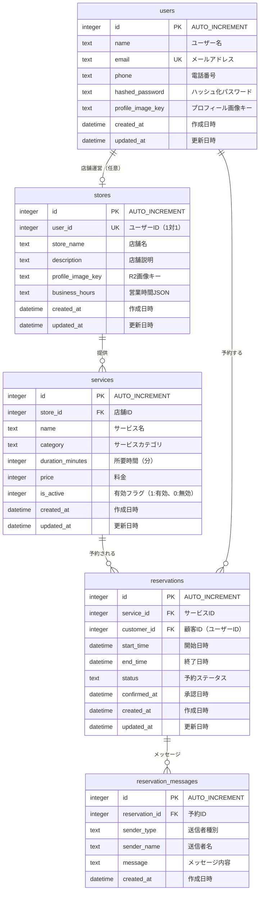

# Appointy データベース設計（ER図）

## ER図



## テーブル詳細

### usersテーブル（ユーザー情報）
| カラム名 | データ型 | 制約 | 説明 |
|---------|---------|------|------|
| id | INTEGER | PRIMARY KEY AUTOINCREMENT | 自動採番の一意識別子 |
| name | TEXT | NOT NULL | ユーザーの名前 |
| email | TEXT | UNIQUE, NOT NULL | ログイン用メールアドレス |
| phone | TEXT | NULL | 電話番号 |
| hashed_password | TEXT | NOT NULL | bcryptでハッシュ化されたパスワード |
| profile_image_key | TEXT | NULL | R2に保存されたユーザープロフィール画像のキー |
| created_at | DATETIME | NOT NULL | レコード作成日時 |
| updated_at | DATETIME | NOT NULL | レコード更新日時 |

### storesテーブル（店舗情報）
| カラム名 | データ型 | 制約 | 説明 |
|---------|---------|------|------|
| id | INTEGER | PRIMARY KEY AUTOINCREMENT | 自動採番の一意識別子 |
| user_id | INTEGER | UNIQUE, FOREIGN KEY, NOT NULL | ユーザーID（users.idへの外部キー、1対1関係） |
| store_name | TEXT | NOT NULL | 店舗名 |
| description | TEXT | NULL | 店舗の説明 |
| profile_image_key | TEXT | NULL | R2に保存された店舗プロフィール画像のキー |
| business_hours | TEXT | NULL | 営業時間（JSON形式） |
| created_at | DATETIME | NOT NULL | レコード作成日時 |
| updated_at | DATETIME | NOT NULL | レコード更新日時 |

### servicesテーブル（提供サービス）
| カラム名 | データ型 | 制約 | 説明 |
|---------|---------|------|------|
| id | INTEGER | PRIMARY KEY AUTOINCREMENT | サービスID |
| store_id | INTEGER | FOREIGN KEY, NOT NULL | 店舗ID（stores.idへの外部キー） |
| name | TEXT | NOT NULL | サービス名 |
| category | TEXT | NOT NULL DEFAULT 'その他' | サービスカテゴリ |
| duration_minutes | INTEGER | NOT NULL | 所要時間（分） |
| price | INTEGER | NOT NULL | 料金（円） |
| is_active | INTEGER | NOT NULL DEFAULT 1 | サービスの有効/無効（1:有効、0:無効） |
| created_at | DATETIME | NOT NULL | レコード作成日時 |
| updated_at | DATETIME | NOT NULL | レコード更新日時 |

### reservationsテーブル（予約情報）
| カラム名 | データ型 | 制約 | 説明 |
|---------|---------|------|------|
| id | INTEGER | PRIMARY KEY AUTOINCREMENT | 予約ID |
| service_id | INTEGER | FOREIGN KEY, NOT NULL | サービスID（services.idへの外部キー） |
| customer_id | INTEGER | FOREIGN KEY, NOT NULL | 顧客ID（users.idへの外部キー） |
| start_time | DATETIME | NOT NULL | 予約開始日時（ISO 8601形式） |
| end_time | DATETIME | NOT NULL | 予約終了日時（ISO 8601形式） |
| status | TEXT | NOT NULL DEFAULT 'pending' | 予約ステータス（pending/confirmed/cancelled） |
| confirmed_at | DATETIME | NULL | 承認日時 |
| created_at | DATETIME | NOT NULL | レコード作成日時 |
| updated_at | DATETIME | NOT NULL | レコード更新日時 |

### reservation_messagesテーブル（予約メッセージ）
| カラム名 | データ型 | 制約 | 説明 |
|---------|---------|------|------|
| id | INTEGER | PRIMARY KEY AUTOINCREMENT | メッセージID |
| reservation_id | INTEGER | FOREIGN KEY, NOT NULL | 予約ID（reservations.idへの外部キー） |
| sender_type | TEXT | NOT NULL | 送信者種別（owner/customer） |
| sender_name | TEXT | NOT NULL | 送信者名 |
| message | TEXT | NOT NULL | メッセージ内容 |
| created_at | DATETIME | NOT NULL | レコード作成日時 |

## インデックス設計

```sql
-- ユーザー検索用
CREATE INDEX idx_users_email ON users(email);

-- 店舗検索用
CREATE INDEX idx_stores_user_id ON stores(user_id);

-- サービス検索用
CREATE INDEX idx_services_store_id ON services(store_id);
CREATE INDEX idx_services_is_active ON services(is_active);

-- 予約検索用
CREATE INDEX idx_reservations_service_id ON reservations(service_id);
CREATE INDEX idx_reservations_customer_id ON reservations(customer_id);
CREATE INDEX idx_reservations_start_time ON reservations(start_time);
CREATE INDEX idx_reservations_status ON reservations(status);

-- 予約メッセージ検索用
CREATE INDEX idx_reservation_messages_reservation_id ON reservation_messages(reservation_id);
CREATE INDEX idx_reservation_messages_created_at ON reservation_messages(created_at);
```

## 営業時間（business_hours）のJSON形式

```json
{
  "monday": {
    "isOpen": true,
    "openTime": "09:00",
    "closeTime": "18:00"
  },
  "tuesday": {
    "isOpen": true,
    "openTime": "09:00",
    "closeTime": "18:00"
  },
  "wednesday": {
    "isOpen": true,
    "openTime": "09:00",
    "closeTime": "18:00"
  },
  "thursday": {
    "isOpen": true,
    "openTime": "09:00",
    "closeTime": "18:00"
  },
  "friday": {
    "isOpen": true,
    "openTime": "09:00",
    "closeTime": "18:00"
  },
  "saturday": {
    "isOpen": false,
    "openTime": null,
    "closeTime": null
  },
  "sunday": {
    "isOpen": false,
    "openTime": null,
    "closeTime": null
  }
}
```