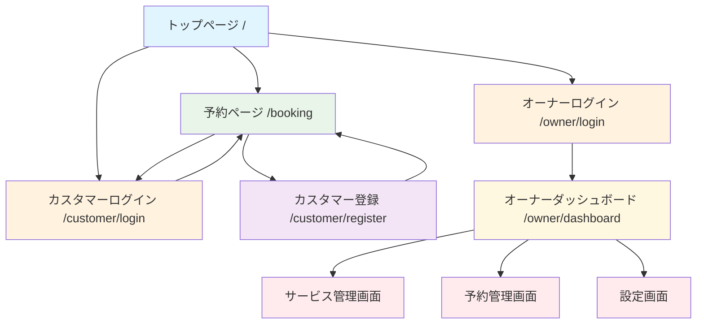

# Appointy 実装状況レポート

## 画面遷移図



## 実装済み画面一覧

### ✅ 実装完了

| 画面名 | パス | 説明 | ステータス |
|--------|------|------|----------|
| トップページ | `/` | ランディングページ、ナビゲーション | ✅ 完了 |
| 予約ページ | `/booking` | サービス選択、予約フォーム | ✅ 完了 |
| オーナーログイン | `/owner/login` | オーナー認証 | ✅ 完了 |
| カスタマーログイン | `/customer/login` | カスタマー認証 | ✅ 完了 |
| カスタマー登録 | `/customer/register` | 新規アカウント作成 | ✅ 完了 |
| オーナーダッシュボード | `/owner/dashboard` | 予約統計、今日の予約 | ✅ 完了 |
| サービス管理 | `/owner/services` | サービスCRUD操作、モーダル対応 | ✅ 完了 |
| 予約管理 | `/owner/reservations` | 予約一覧、フィルター、詳細表示、キャンセル | ✅ 完了 |
| 設定画面 | `/owner/settings` | プロフィール編集、画像アップロード、営業時間設定 | ✅ 完了 |

### 🔄 設計変更

| 画面名 | パス（設計） | 実装パス | 変更理由 |
|--------|-------------|---------|---------|
| 予約フォーム | `/book` | `/booking`に統合 | UX向上のため統合 |
| 完了画面 | `/thanks` | アラート表示 | シンプルな実装 |

## レイアウト構成

### デフォルトレイアウト
- ヘッダー：ブランドロゴ、ナビゲーション
- フッター：コピーライト
- 使用画面：トップページ、予約ページ

### オーナーレイアウト
- ヘッダーナビゲーション（ダッシュボード、サービス管理、予約管理、設定、ログアウト）
- 使用画面：オーナーダッシュボード、サービス管理、予約管理、設定画面

### レイアウトなし
- 使用画面：ログイン画面系

## API実装状況

### ✅ 実装完了

#### 認証関連
| エンドポイント | メソッド | 説明 | ステータス |
|---------------|---------|------|----------|
| `/api/auth/login` | POST | オーナーログイン | ✅ 完了 |
| `/api/auth/customer-login` | POST | カスタマーログイン | ✅ 完了 |
| `/api/auth/customer-register` | POST | カスタマー登録 | ✅ 完了 |
| `/api/auth/me` | GET | 認証ユーザー情報取得 | ✅ 完了 |
| `/api/auth/logout` | POST | ログアウト | ✅ 完了 |

#### オーナー向けAPI（認証必須）
| エンドポイント | メソッド | 説明 | ステータス |
|---------------|---------|------|----------|
| `/api/owner/services` | GET | サービス一覧取得 | ✅ 完了 |
| `/api/owner/services` | POST | サービス作成 | ✅ 完了 |
| `/api/owner/services/[id]` | GET | サービス詳細取得 | ✅ 完了 |
| `/api/owner/services/[id]` | PUT | サービス更新 | ✅ 完了 |
| `/api/owner/services/[id]` | DELETE | サービス削除 | ✅ 完了 |
| `/api/owner/reservations` | GET | 予約一覧取得 | ✅ 完了 |
| `/api/owner/reservations/[id]` | GET | 予約詳細取得 | ✅ 完了 |
| `/api/owner/reservations/[id]` | DELETE | 予約キャンセル | ✅ 完了 |
| `/api/owner/profile` | GET | プロフィール取得 | ✅ 完了 |
| `/api/owner/profile` | PUT | プロフィール更新 | ✅ 完了 |
| `/api/owner/profile/image` | POST | 画像アップロード | ✅ 完了 |
| `/api/owner/profile/image` | PUT | 画像更新 | ✅ 完了 |
| `/api/owner/profile/image` | DELETE | 画像削除 | ✅ 完了 |

#### 公開API（認証不要）
| エンドポイント | メソッド | 説明 | ステータス |
|---------------|---------|------|----------|
| `/api/public/profile` | GET | 店舗プロフィール取得 | ✅ 完了 |
| `/api/public/services` | GET | サービス一覧取得 | ✅ 完了 |
| `/api/public/services/[id]` | GET | サービス詳細取得 | ✅ 完了 |
| `/api/public/available-slots` | GET | 予約可能時間取得 | ✅ 完了 |
| `/api/public/reservations` | POST | 予約作成 | ✅ 完了 |

### ❌ 設計書との差異

#### 追加実装されたAPI
- `/api/auth/customer-login` - カスタマー専用ログイン（設計書では想定外）
- `/api/auth/customer-register` - カスタマー登録（設計書では想定外）
- `/api/auth/logout` - ログアウト（設計書では想定外）

#### 設計変更点
- カスタマーとオーナーで別々の認証APIを実装
- 予約作成は認証必須に変更（設計書では認証不要）

## データベース実装状況

### ✅ 実装完了

| テーブル | 説明 | ステータス |
|---------|------|----------|
| users | ユーザー（オーナー・カスタマー共通） | ✅ 完了 |
| services | サービス情報 | ✅ 完了 |
| reservations | 予約情報 | ✅ 完了 |

### 機能実装状況

#### ✅ 完全実装
- ユーザー認証（JWT + Cookie）
- サービス管理（CRUD）
- 予約作成・管理
- プロフィール管理
- 画像アップロード（MinIO連携）
- 営業時間管理
- 予約可能時間計算

#### ⚠️ 部分実装
- メール通知機能（設計のみ、実装なし）
- パスワードリセット（設計のみ、実装なし）

#### ❌ 未実装
- カレンダー表示機能（予約管理画面で一覧表示のみ実装）
- リマインドメール機能

## 次の開発優先度

### 高優先度
1. **カレンダー表示機能** - 予約管理画面の視覚的改善
2. **エラーハンドリングの改善** - ユーザビリティ向上

### 中優先度
3. **メール通知機能** - 予約確認・リマインドメール
4. **レスポンシブデザインの最適化**

### 低優先度
5. **パスワードリセット機能**
6. **管理画面のダークモード対応**

## アーキテクチャ概要

```
frontend (Nuxt 3)
├── pages/               # ページコンポーネント
├── layouts/            # レイアウト
├── components/         # 再利用可能コンポーネント
├── composables/        # Composition API
└── server/
    ├── api/           # APIエンドポイント
    ├── database/      # DB接続・スキーマ
    ├── utils/         # ユーティリティ
    └── plugins/       # サーバープラグイン

database (SQLite)
├── users              # ユーザー情報
├── services           # サービス情報
└── reservations       # 予約情報

storage (MinIO)
└── appointy/          # プロフィール画像
```

## 技術スタック

- **フロントエンド**: Nuxt 3, Vue 3, TypeScript, Tailwind CSS
- **バックエンド**: Nuxt Server API (h3)
- **データベース**: SQLite (開発), better-sqlite3
- **認証**: JWT + httpOnly Cookie
- **ストレージ**: MinIO (開発), Cloudflare R2 (本番)
- **バリデーション**: Zod
- **パスワードハッシュ化**: bcryptjs
- **開発環境**: Docker + Docker Compose

---
*最終更新: 2025-07-10*