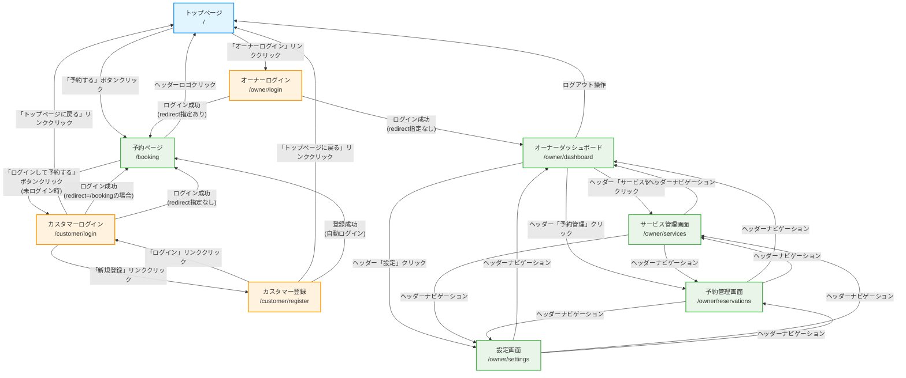
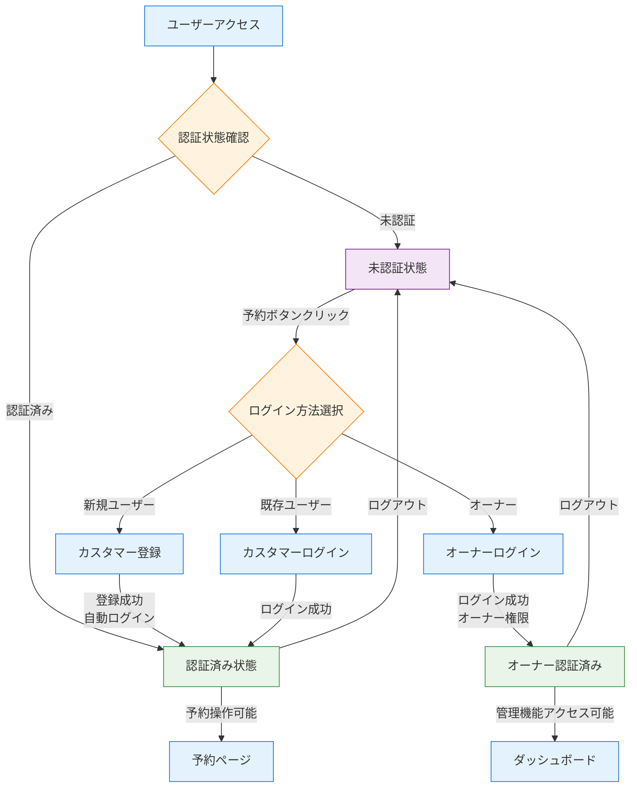

# Appointy 画面遷移図

## 詳細画面遷移図



## 認証フロー



## ナビゲーション構造

### ヘッダーナビゲーション（デフォルトレイアウト）
```
[Appointy Logo] ────────────────── [予約する] [オーナーログイン]
      ↓                              ↓           ↓
   "/" へ遷移                    "/booking"  "/owner/login"
```

### オーナーヘッダーナビゲーション
```
[Appointy オーナー] ─ [ダッシュボード] [サービス管理] [予約管理] [設定] [ログアウト]
        ↓                    ↓            ↓          ↓        ↓        ↓
"/owner/dashboard"    "/owner/dashboard" "/owner/services" "/owner/reservations" "/owner/settings" "/"
```

## 遷移パターン

### 1. 一般ユーザーの予約フロー
```
トップページ → 予約ページ → カスタマーログイン → 予約ページ(認証済み) → 予約完了
     ↓              ↓              ↓                ↓
   ランディング    サービス選択    認証処理        予約フォーム送信
```

### 2. 新規ユーザーの予約フロー
```
トップページ → 予約ページ → カスタマーログイン → カスタマー登録 → 予約ページ(認証済み)
     ↓              ↓              ↓              ↓              ↓
   ランディング    サービス選択    ログイン画面    新規登録        自動ログイン
```

### 3. オーナーの管理フロー
```
トップページ → オーナーログイン → ダッシュボード → 各管理画面
     ↓              ↓              ↓              ↓
   ランディング      認証          統計・予約確認   CRUD操作
```

## リダイレクト仕様

### ログイン後のリダイレクト
- **カスタマーログイン**: `?redirect=/booking` → 予約ページへ
- **オーナーログイン**: `?redirect=` 指定なし → ダッシュボードへ
- **新規登録**: 自動で予約ページへ

### エラー時の動作
- **認証エラー**: ログインページへリダイレクト
- **権限エラー**: トップページへリダイレクト
- **404エラー**: 現在のページに留まる

## 実装状況

| 画面 | 実装状況 | 遷移実装 | 備考 |
|------|----------|----------|------|
| トップページ | ✅ 完了 | ✅ 完了 | ランディング + ナビゲーション |
| 予約ページ | ✅ 完了 | ✅ 完了 | 認証状態に応じたボタン表示 |
| カスタマーログイン | ✅ 完了 | ✅ 完了 | リダイレクト対応済み |
| カスタマー登録 | ✅ 完了 | ✅ 完了 | 自動ログイン機能 |
| オーナーログイン | ✅ 完了 | ✅ 完了 | リダイレクト対応済み |
| オーナーダッシュボード | ✅ 完了 | ✅ 完了 | ヘッダーナビゲーション実装済み |
| サービス管理 | ✅ 完了 | ✅ 完了 | CRUD機能、モーダル対応 |
| 予約管理 | ✅ 完了 | ✅ 完了 | 一覧表示、フィルター、詳細 |
| 設定画面 | ✅ 完了 | ✅ 完了 | プロフィール編集、営業時間設定 |

---
*最終更新: 2025-07-10*