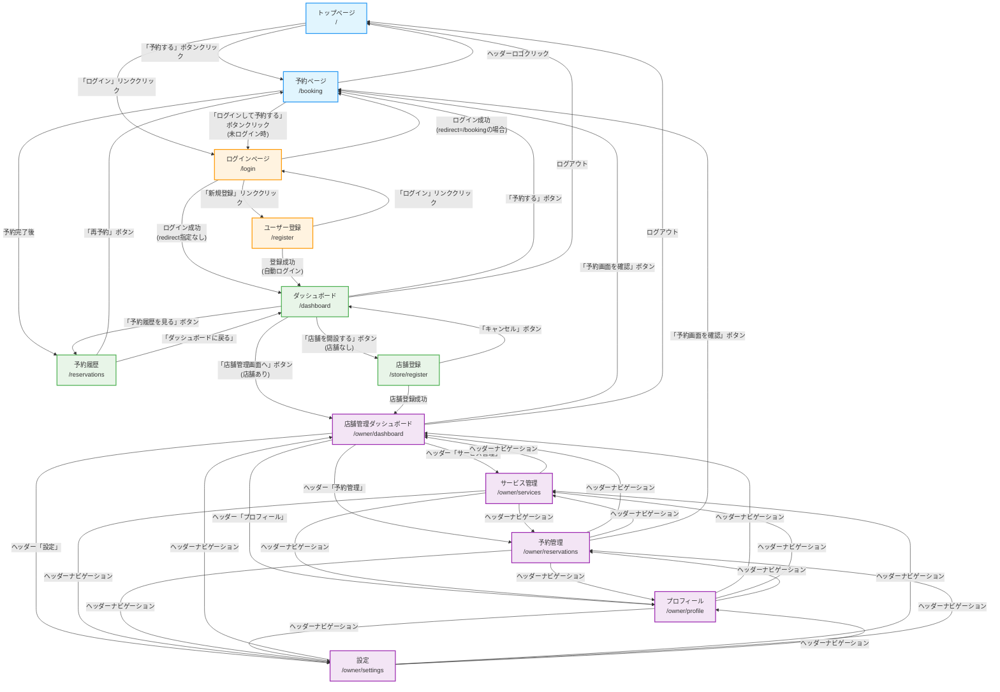
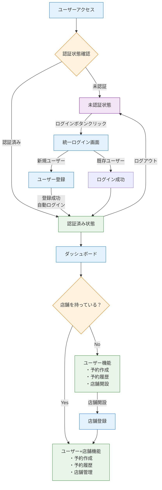

# Appointy 画面遷移図

## 統一ユーザーシステム画面遷移図



## 統一認証フロー



## ナビゲーション構造

### パブリックヘッダーナビゲーション（未ログイン時）
```
[Appointy Logo] ────────────────── [予約する] [ログイン]
      ↓                              ↓         ↓
   "/" へ遷移                    "/booking"  "/login"
```

### ユーザー認証後のナビゲーション（ログイン時）
```
[Appointy] ──────────────────── [予約する] [予約履歴] [ダッシュボード] [ログアウト]
    ↓                              ↓        ↓         ↓            ↓
 "/" へ遷移                    "/booking" "/reservations" "/dashboard"  "/"
```

### 店舗管理ヘッダーナビゲーション
```
[Appointy 店舗管理] ─ [ダッシュボード] [サービス管理] [予約管理] [プロフィール] [設定] [ログアウト]
        ↓                    ↓            ↓          ↓          ↓          ↓        ↓
"/owner/dashboard"    "/owner/dashboard" "/owner/services" "/owner/reservations" "/owner/profile" "/owner/settings" "/"
```

## ユーザージャーニー

### 1. 新規ユーザーの予約フロー
```
トップページ → 予約ページ → ログイン画面 → ユーザー登録 → 予約ページ(認証済み) → 予約完了 → 予約履歴
     ↓              ↓           ↓          ↓           ↓                ↓         ↓
   ランディング    サービス選択   認証要求    新規登録     予約フォーム送信       完了通知   履歴確認
```

### 2. 既存ユーザーの予約フロー
```
トップページ → 予約ページ → ログイン画面 → 予約ページ(認証済み) → 予約完了 → 予約履歴
     ↓              ↓           ↓           ↓                ↓         ↓
   ランディング    サービス選択   認証処理     予約フォーム送信       完了通知   履歴確認
```

### 3. 店舗運営者のジャーニー
```
ログイン → ダッシュボード → 店舗開設 → 店舗管理ダッシュボード → 各管理機能
    ↓           ↓           ↓          ↓                   ↓
  認証処理     メイン画面     店舗作成     管理画面遷移        CRUD操作
```

### 4. 予約履歴確認フロー
```
ダッシュボード → 予約履歴 → 予約詳細確認/キャンセル/再予約
      ↓            ↓              ↓
   メイン画面     履歴一覧        アクション実行
```

## リダイレクト仕様

### ログイン後のリダイレクト
- **統一ログイン**: `?redirect=/booking` → 予約ページへ
- **統一ログイン**: `?redirect=` 指定なし → ダッシュボードへ
- **新規登録**: 自動でダッシュボードへ

### エラー時の動作
- **認証エラー**: ログインページへリダイレクト（`?redirect=現在のURL`）
- **店舗権限エラー**: 店舗登録ページへリダイレクト
- **404エラー**: 404ページ表示

### ミドルウェア制御
- **auth.js**: 基本認証チェック → 未認証時ログインページへ
- **auth-owner.js**: 店舗所有者チェック → 店舗なし時店舗登録ページへ

## 現在の実装状況

| 画面 | 実装状況 | 遷移実装 | 認証・認可 | 備考 |
|------|----------|----------|------------|------|
| トップページ | ✅ 完了 | ✅ 完了 | パブリック | ランディング + ナビゲーション |
| 予約ページ | ✅ 完了 | ✅ 完了 | 認証必須* | 認証状態に応じたUI表示 |
| 統一ログイン | ✅ 完了 | ✅ 完了 | パブリック | リダイレクト対応済み |
| ユーザー登録 | ✅ 完了 | ✅ 完了 | パブリック | 自動ログイン機能 |
| ダッシュボード | ✅ 完了 | ✅ 完了 | 認証必須 | 店舗状態に応じた表示 |
| 予約履歴 | ✅ 完了 | ✅ 完了 | 認証必須 | キャンセル・再予約機能 |
| 店舗登録 | ✅ 完了 | ✅ 完了 | 認証必須 | デフォルトサービス作成 |
| 店舗管理ダッシュボード | ✅ 完了 | ✅ 完了 | 店舗所有必須 | 統計・予約確認 |
| サービス管理 | ✅ 完了 | ✅ 完了 | 店舗所有必須 | CRUD機能、モーダル対応 |
| 予約管理 | ✅ 完了 | ✅ 完了 | 店舗所有必須 | 一覧表示、フィルター、詳細 |
| プロフィール | ✅ 完了 | ✅ 完了 | 店舗所有必須 | 店舗情報編集、画像アップロード |
| 設定画面 | ✅ 完了 | ✅ 完了 | 店舗所有必須 | 営業時間設定 |

### 注記
- *予約ページ: 閲覧はパブリック、予約作成は認証必須
- 全画面レスポンシブ対応済み
- 統一されたユーザーシステムで運用

## 最新の改善点（2025-07-12）

### 🔄 画面遷移の更新
- **予約完了後の導線**: 予約完了後はダッシュボードではなく予約履歴ページへリダイレクト
- **店舗管理からの導線**: owner/dashboard、owner/reservationsから「予約画面を確認」ボタンで予約ページへ遷移可能
- **動的ナビゲーション**: ログイン状態に応じてヘッダーメニューが動的に変化

### 🎯 UX改善
- **トップページ**: ログイン時は「ログイン/新規登録」の代わりに「ダッシュボード」ボタンを表示
- **全店舗サービス表示**: 予約ページで全店舗のサービスが表示され、店舗名も併記
- **予約詳細確認**: 店舗所有者は予約管理画面から詳細モーダルで予約情報を確認可能

---
*最終更新: 2025-07-12*