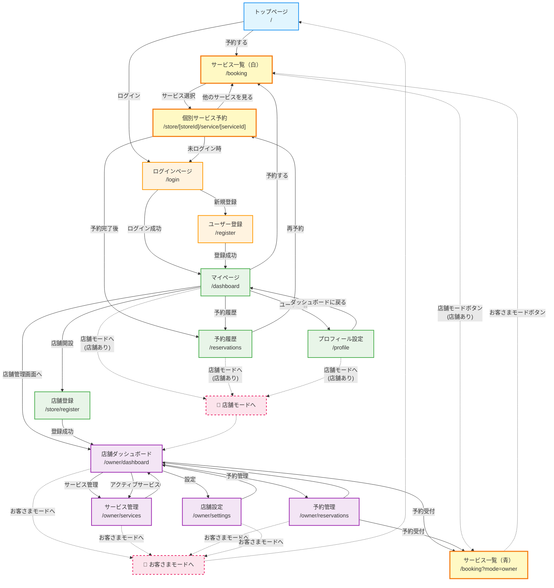
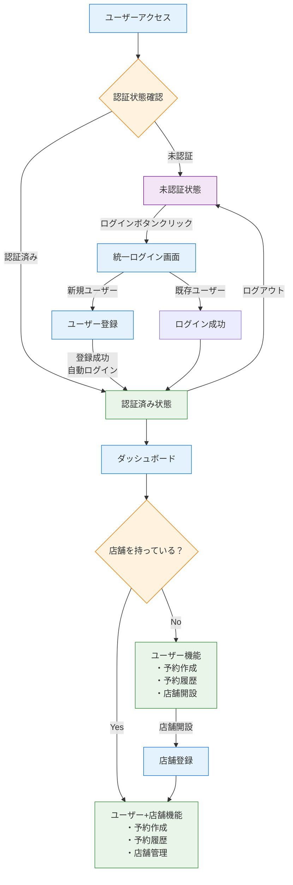

# Appointy 画面遷移図

## モード切り替え対応画面遷移図 (2025-07-13更新)

### 概要
- **お客さまモード**: 白いヘッダー、予約・履歴確認中心
- **店舗モード**: 青いヘッダー、店舗管理中心  
- **予約ページ**: 来た場所に応じてヘッダーを自動切替
- **ワンクリックモード切替**: ヘッダーボタンで即座にモード変更



## 統一認証フロー



## ナビゲーション構造（モード切り替え対応）

### 🌟 お客さまモード（白いヘッダー）
```
[Appointy] ──── [予約する] [予約履歴] [マイページ] [田中さん] [店舗モードへ*] [ログアウト]
    ↓              ↓        ↓         ↓         ↓         ↓             ↓
    /          /booking  /reservations /dashboard /profile /owner/dashboard  /
                                                            (*店舗あり時のみ)
```

### 🏪 店舗モード（青いヘッダー）
```
[Appointy 店舗] ─ [ダッシュボード] [サービス管理] [予約管理] [予約受付] [設定] [お客さまモードへ] [ログアウト]
      ↓               ↓           ↓          ↓         ↓       ↓         ↓              ↓
 /owner/dashboard /owner/dashboard /owner/services /owner/reservations /booking?mode=owner /owner/settings  /  /

注: 店舗ダッシュボードのユーザー名は表示のみ（クリック不可）
```

### 📱 予約ページ（動的ヘッダー）
```
来た場所に応じて自動でヘッダーを切り替え:
- お客さまモードから → 白いヘッダー（通常の /booking）
- 店舗モードから → 青いヘッダー（/booking?mode=owner）
- 直接アクセス → 白いヘッダー（デフォルト）
```

### 🔄 モード切り替えボタン
- **お客さまモード**: 店舗を持つユーザーにのみ「店舗モードへ」ボタン表示
- **店舗モード**: 常に「お客さまモードへ」ボタン表示
- **ワンクリック切り替え**: 即座にモード変更とページ遷移

## ユーザージャーニー

### 1. 新規ユーザーの予約フロー
```
トップページ → 予約ページ → ログイン画面 → ユーザー登録 → 予約ページ(認証済み) → 予約完了 → 予約履歴
     ↓              ↓           ↓          ↓           ↓                ↓         ↓
   ランディング    サービス選択   認証要求    新規登録     予約フォーム送信       完了通知   履歴確認
```

### 2. 既存ユーザーの予約フロー
```
トップページ → 予約ページ → ログイン画面 → 予約ページ(認証済み) → 予約完了 → 予約履歴
     ↓              ↓           ↓           ↓                ↓         ↓
   ランディング    サービス選択   認証処理     予約フォーム送信       完了通知   履歴確認
```

### 3. 店舗運営者のジャーニー
```
ログイン → ダッシュボード → 店舗開設 → 店舗管理ダッシュボード → 各管理機能
    ↓           ↓           ↓          ↓                   ↓
  認証処理     メイン画面     店舗作成     管理画面遷移        CRUD操作
```

### 4. 予約履歴確認フロー
```
ダッシュボード → 予約履歴 → 予約詳細確認/キャンセル/再予約
      ↓            ↓              ↓
   メイン画面     履歴一覧        アクション実行
```

## リダイレクト仕様

### ログイン後のリダイレクト
- **統一ログイン**: `?redirect=/booking` → 予約ページへ
- **統一ログイン**: `?redirect=` 指定なし → ダッシュボードへ
- **新規登録**: 自動でダッシュボードへ

### エラー時の動作
- **認証エラー**: ログインページへリダイレクト（`?redirect=現在のURL`）
- **店舗権限エラー**: 店舗登録ページへリダイレクト
- **404エラー**: 404ページ表示

### ミドルウェア制御
- **auth.js**: 基本認証チェック → 未認証時ログインページへ
- **auth-owner.js**: 店舗所有者チェック → 店舗なし時店舗登録ページへ

## 現在の実装状況

| 画面 | 実装状況 | 遷移実装 | 認証・認可 | 備考 |
|------|----------|----------|------------|------|
| トップページ | ✅ 完了 | ✅ 完了 | パブリック | ランディング + ナビゲーション |
| 予約ページ | ✅ 完了 | ✅ 完了 | 認証必須* | 認証状態に応じたUI表示 |
| 統一ログイン | ✅ 完了 | ✅ 完了 | パブリック | リダイレクト対応済み |
| ユーザー登録 | ✅ 完了 | ✅ 完了 | パブリック | 自動ログイン機能 |
| ダッシュボード | ✅ 完了 | ✅ 完了 | 認証必須 | 店舗状態に応じた表示 |
| 予約履歴 | ✅ 完了 | ✅ 完了 | 認証必須 | キャンセル・再予約機能 |
| 店舗登録 | ✅ 完了 | ✅ 完了 | 認証必須 | デフォルトサービス作成 |
| 店舗管理ダッシュボード | ✅ 完了 | ✅ 完了 | 店舗所有必須 | 統計・予約確認 |
| サービス管理 | ✅ 完了 | ✅ 完了 | 店舗所有必須 | CRUD機能、モーダル対応 |
| 予約管理 | ✅ 完了 | ✅ 完了 | 店舗所有必須 | 一覧表示、フィルター、詳細 |
| プロフィール | ✅ 完了 | ✅ 完了 | 店舗所有必須 | 店舗情報編集、画像アップロード |
| 設定画面 | ✅ 完了 | ✅ 完了 | 店舗所有必須 | 営業時間設定 |

### 注記
- *予約ページ: 閲覧はパブリック、予約作成は認証必須
- 全画面レスポンシブ対応済み
- 統一されたユーザーシステムで運用

## 🎉 最新の改善点（2025-07-13）

### 🔄 モード切り替え機能の実装
- **デュアルモードシステム**: お客さまモード（白）と店舗モード（青）の完全分離
- **ワンクリック切り替え**: ヘッダーボタンで即座にモード変更
- **動的ヘッダー**: 予約ページは来た場所に応じてヘッダーを自動切替
- **統一コンポーネント**: AppHeaderで全モードを管理

### 🎯 UX大幅改善
- **直感的なナビゲーション**: 「ダッシュボード」→「マイページ」に名称変更
- **役割明確化**: お客さまとして利用 vs 店舗として管理の区別が明確
- **混乱解消**: 予約ページでの意図しないモード変更を防止
- **ユーザビリティ向上**: どちらのモードにいるかが一目で分かる

### 🛠️ 技術的改善  
- **共通ヘッダーコンポーネント**: レイアウト間でのヘッダー重複解消
- **レイアウト統一**: definePageMetaによる一貫したレイアウト管理
- **認証状態管理**: モード切り替え時の適切な状態更新

## 🎉 最新の変更点（2025-07-18）

### 📝 UI/UX改善
- **店舗ダッシュボード**: ユーザー名を表示専用に変更（プロフィールページへのリンクを削除）
- **アクティブサービス**: クリック可能にしてサービス管理ページへの遷移を追加
- **一貫性向上**: 店舗モードでは設定ページ経由でのプロフィール管理に統一

---
*最終更新: 2025-07-18*